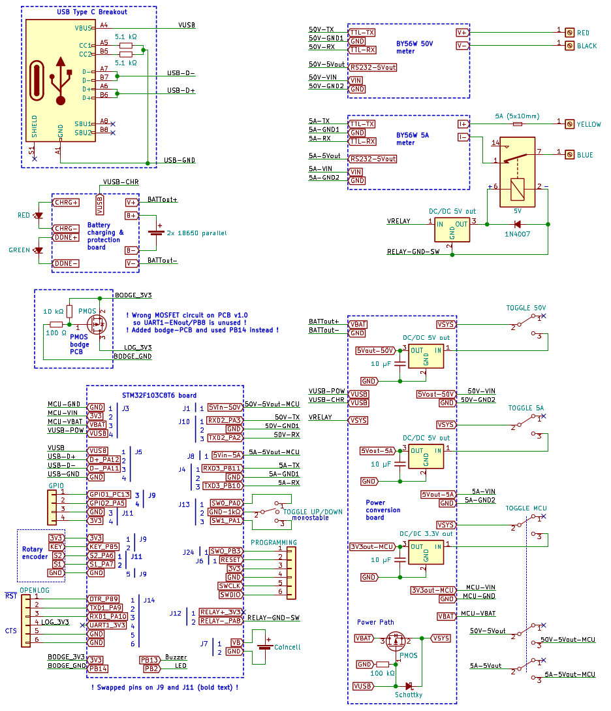
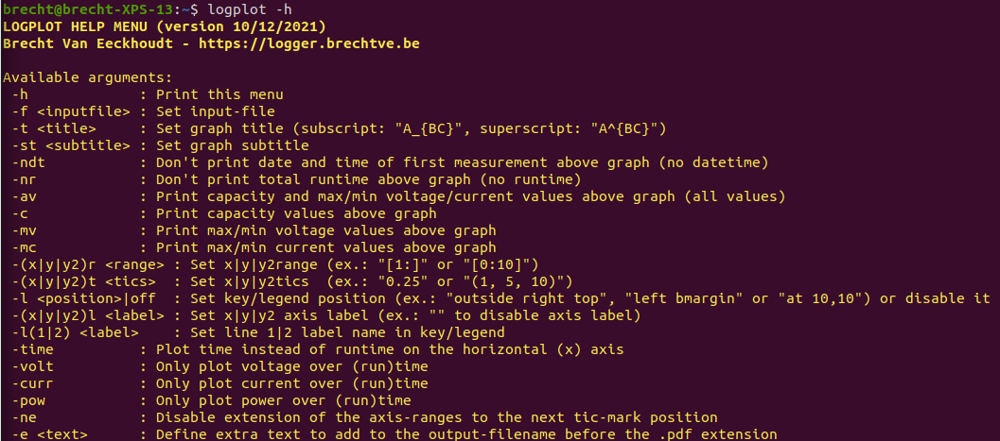

# DIY Logging Volt/Ampmeter


<br/>


<br/>

| Quick access links | |
|------|-----|
| [Carrier board v1.0 schematic (PDF)](hardware/high-accuracy-logging-volt-ampmeter/high-accuracy-logging-volt-ampmeter.pdf) | [Doxygen code documentation of individual files and methods](https://fescron.github.io/diy-logging-volt-ampmeter/files.html) |
| [Wiring diagram v1.0 (PDF)](hardware/wiring-diagram_diy-logging-volt-ampmeter/wiring-diagram_diy-logging-volt-ampmeter.pdf) | [Doxygen TODO's](https://fescron.github.io/diy-logging-volt-ampmeter/todo.html) |

<br/>

This battery-powered logging volt/ampmeter was made with the intention to easily get `.CSV` files filled with voltage/current/power measurements on a SD-card to plot and use this data further. It is supposed to have the same functionality as much more expensive dataloggers, with the added benefit of the ability to change the firmware to add more functions.

<br/>

## 0 - Table of Contents

- [DIY Logging Volt/Ampmeter](#diy-logging-voltampmeter)
  - [0 - Table of Contents](#0---table-of-contents)
  - [1 - Construction](#1---construction)
  - [2 - Usage](#2---usage)
  - [3 - Bash script to generate plots (logplot)](#3---bash-script-to-generate-plots-logplot)
  - [4 - Additional hardware changes (carrier board v1.0)](#4---additional-hardware-changes-carrier-board-v10)
  - [5 - Future code-additions](#5---future-code-additions)

<br/>

## 1 - Construction


<br/>

The device consists of **two Chinese** (but very accurate and highly functional) **meters** ([BY56W 50V](https://aliexpress.com/item/32840631947.html) and [BY56W 5A](https://aliexpress.com/item/32839044728.html)) with independent power-supplies so no *common-mode* errors can occur. They can be individually powered on or off with **toggle switches** left of these meters. On the right of them are **combination banana- and screw-terminals** to easily connect measurement cables. The black and red one are the negative and positive terminal of the voltmeter, the blue and yellow one are the negative and positive terminal of the current meter. In series with the latter plugs and the current meter are a **5A 5x10mm fuse** (fitted in a holder on right right side of the logger), along with an **5V internal NC-relay** (with a [5V boostconverter](https://aliexpress.com/item/32891706812.html) and protection-diode) to open the current connection in certain scenarios (over-voltage, over-current, under-voltage, ...). Currently no code is written to use this relay functionality.

On the bottom a **third module** with the same shell as the voltage and current meters (I asked the Chinese store if they could sell me some) is situated with **two [1.3" 128x64 I2C OLED-displays](https://aliexpress.com/item/32830144222.html)** and a **STM32 Blue-Pill board** (with a genuine (!) ST `STM32F103C8T6` microcontroller). This functions as the brains of the whole unit. This bottom module can also be switched on or off with the **toggle switch** to the left. The display-module *asks* the two meters for measurement values and does additional conversions and calculations with them, drives the displays, keeps the time with its **internal RTC and 3V coincell backup-battery**, reads the battery voltage, outputs the measurements to the UART port on top, ... Next to the bottom module an **up/down monostable toggle switch** and **[pressable rotary encoder](https://aliexpress.com/item/32915420023.html)** can be used to start or stop logging, view measurements, change settings, ...

This module however **does not write the data to a SD-card directly**. For this a **[Sparkfun OpenLog](https://www.sparkfun.com/products/13712) module** has to be plugged in to the **external UART port on top**. Because of the way the firmware is developed, a new `.TXT` file is created each time a new measurement-session is started. The resulting file can be easily renamed to a `.CSV` file to facilitate importing in *Excel* or *OpenOffice Calc*. The first line of the file contains a header which explains what data goes where in the following measurement-lines. The last two lines of the file contain another header with corresponding data like date, total runtime, capacity and maximum/minimum values.

The whole thing is powered by **two (parallel) 18650 batteries** in a [battery holder](https://aliexpress.com/item/32832636191.html). A [charge and battery-protection PCB](https://aliexpress.com/item/32666559864.html) facilitates charging at 1A using **USB Type-C** on the left side of the meter. I used a [breakout-board](https://aliexpress.com/item/4001299632280.html) with two 5.1k resistors on the `CC1` and `CC2` pins to activate the 5V output on USB-PD compliant chargers. Above this Type-C port ***charging* and *done* LED's** are also fitted. Right of this the **programming-port** and two **external GPIO-pins** with a 3.3V and GND terminal on *Dupont*-connectors are situated. These two external GPIO-pins however currently have no function. Internally there also is a **buzzer** which can be used to signal various states, but no code is written to use this functionality as well. Some buck-boost converters (after the toggle switches) are also placed on a prototype-PCB to convert the battery voltage to 5V (with [these boostconverters](https://aliexpress.com/item/32891706812.html)) for the meters and 3.3V (with [this buck/boostconverter](https://aliexpress.com/item/32822323191.html)) for the bottom STM32-display-module.

The picture below depicts the internal wiring-diagram, standalone modules/boards are surrounded in blue frames.

<br/>



<br/>

## 2 - Usage

The **up/down monostable toggle-switch** and **pressable rotary encoder** on the right of the bottom display-module are used to switch between display-pages and to set various settings.

The **left display** always indicates the power on the top. If the display is selected (*selection-line* drawn on the bottom of the display) the rotary encoder can be used to switch between the different pages to display additional information: max/min voltage, max/min current and calculated capacity in Ah and Wh. Upon an encoder-press the displayed information can be reset (if the logger is not saving data to a SD-card). Below these three available pages on the left display are depicted.


<br/>

A down-press on the monostable toggle-switch changes the selected display. The *selection-line* on the bottom of the display will be moved to the newly selected display.

The **right display** always indicates the internal battery voltage and state of the logger (`STOP/START/RUN/SAVE`) on the top. If this display is selected (*selection-line* drawn on the bottom of the display) the rotary encoder can again be used to switch between the different pages to display additional information. The first page displays the current date and time, and pressing the encoder enables the user to change this information. Values are changed by rotating the encoder, the value (for example the day) is saved on an encoder-press, and the next item (for example the month) can now be edited. The second page displays the period between measurements saved to the logfile with the external logger. Pressing the encoder activates the ability to change the period by rotating the encoder, pressing it again saves the value. The third page displays the runtime if the logger is saving data to the external logger. Below these three available pages on the right display are depicted.


<br/>

An up-press on the monostable toggle switch (if the logger is in `STOP`-mode) powers-up the external logger (`START`) and writes the *header*, along with a first measurement-line to the `.TXT` file (`SAVE`). Then the logger waits (`RUN`) until the measurement-period runs out and writes another measurement to the file (`SAVE`). Another up-press on the monostable toggle switch stops the logging and writes two more lines to the end of the file including data as the date, total runtime, capacity, max/min values, ... An example of the resulting data in such a `.TXT` file is depicted below.

```
Time [hour:min:sec],Runtime [hour:min:sec],Voltage [V],Current [A],Power [W]
17:46:21,00:00:01,1.291,0.0000,0.000
17:46:23,00:00:03,1.291,0.0000,0.000
17:46:25,00:00:05,1.291,0.0000,0.000
17:46:27,00:00:07,1.291,0.0000,0.000
17:46:29,00:00:09,0.875,0.0000,0.000
17:46:31,00:00:11,1.092,0.0000,0.000
17:46:33,00:00:13,1.290,0.0000,0.000
Date [day/month/year],Runtime [hour:min:sec],Capacity [Ah],Capacity [Wh],Max Volt [V],Min Volt [V],Max Curr [A],Min Curr [A]
17/08/2021,00:00:13,00.000,00.000,01.291,00.000,0.0000,0.0000
```

<br/>

## 3 - Bash script to generate plots (logplot)

To easily convert the `.txt`/`.csv` files from this meter and get **plots in PDF-form**, a bash-script using `gnuplot` and `ps2pdf`/`imagemagick` was created. To create a PDF-plot of a file (`LOG00110.TXT`) with the title "Title" and subtitle "Subtitle", and to make sure the capacity and max/min voltage and current values are displayed above the graph, one can use the following command:

```bash
logplot -f "LOG00110.TXT" -t "Title" -st "Subtitle" -at
```

<br/>

Below is a list of all of the possible commands, which can also be shown with the command `logplot -h`. The bash-script itself can be found [here](software/logplot)



<br/>

## 4 - Additional hardware changes (carrier board v1.0)

To simplify the firmware for the rotary encoder logic some pins were swapped around on header `J9` and `J11`. This is highlighted by bold text on the wiring-diagram on the **STM32F103C8T6 board**.

Unfortunately a wrong MOSFET was used for the function to power the external Openlog UART datalogger on or off. This means that MCU pin `UART1-ENout/PB8` is unused and a **PMOS bodge PCB** was constructed. This can be seen on the wiring-diagram. MCU pin `PB14` is used instead to power the logger.

<br/>

## 5 - Future code-additions

The firmware is constructed with a lot of extra variables to facilitate the functionality to only update changed values on the displays. This speeds up the code but does however create a lot of *overhead*. In the future this can certainly be optimized.

As of yet not all of the hardware is used, like for example the relay and buzzer. All TODO's can be found in the [Doxygen TODO's](https://fescron.github.io/diy-logging-volt-ampmeter/todo.html).
